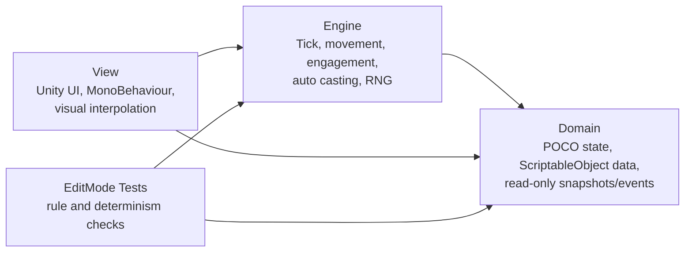

# MurimRunaway

무림도망자는 Unity 기반 모바일 세로형 오토배틀 로그라이트 프로토타입입니다.
이 저장소의 목적은 완성된 콘텐츠 양을 보여주는 것이 아니라, **테스트 가능한 전투 시뮬레이션 구조**와 **재현 가능한 게임 규칙 구현 방식**을 보여주는 데 있습니다.

## Hiring Snapshot

- Unity 6000.3.14f1 기반 C# 프로젝트
- `Domain / Engine / View` 3계층 분리와 asmdef 의존성으로 룰 계층을 격리
- 고정 Tick, 시드 기반 RNG, Snapshot 발행으로 재현 가능한 전투 흐름 설계
- EditMode 테스트로 이동, 교전, 자원 변경, 자동 시전 우선순위, 쿨다운, 결정성을 검증
- SSOT 문서와 Phase별 Acceptance 체크리스트로 설계 변경과 구현 범위를 추적

## Current Status

현재 구현은 전투 코어의 초기 단계입니다.

| Area | Status |
|------|--------|
| Phase 0 | Foundation, asmdef, Tick/RNG service, empty battle flow |
| Phase 1 | Actor model, 1D distance axis, player approach, nearest enemy engagement |
| Phase 2 | HP, mana, momentum resource container and mutation boundary |
| Phase 3 | SkillData, skill slots, automatic casting priority, cooldown and determinism |
| Phase 4+ | Damage, death, victory/defeat and boss mind-game systems are documented next steps |

The project intentionally keeps visuals simple while the battle rules are still being proven.

## Architecture

Key rules:

- `Domain` does not reference `Engine`.
- `Engine` does not reference `View`.
- `View` renders snapshots and does not write interpolated values back into engine state.
- Battle randomness goes through `IRngService`.
- Engine time advances through `ITickService` instead of direct `Time.deltaTime` usage.

## What To Review

| Focus | Path |
|-------|------|
| Battle system design SSOT | `Docs/BATTLE_DESIGN.md` |
| Milestone plan | `Docs/MILESTONES.md` |
| Engine entry point | `Assets/_Project/Scripts/Battle/Engine/BattleEngine.cs` |
| Tick systems | `Assets/_Project/Scripts/Battle/Engine/Systems/` |
| Domain data and snapshots | `Assets/_Project/Scripts/Battle/Domain/` |
| EditMode tests | `Assets/_Project/Tests/Battle/` |
| Layer rules | `Assets/_Project/Scripts/Battle/AGENTS.md` |

## Test Coverage Signals

The current EditMode tests cover:

- deterministic RNG sequence
- pause/resume tick behavior
- player approach and nearest enemy engagement
- battle snapshot determinism
- mana and momentum mutation boundaries
- automatic casting priority
- skill cooldown behavior
- casting sequence determinism

These tests are small on purpose. Each Phase adds only the tests needed to close its Acceptance checklist.

## How To Inspect Locally

1. Open the project with Unity `6000.3.14f1`.
2. Open `MurimRunaway.slnx` for code navigation.
3. In Unity Test Runner, run EditMode tests under `Assets/_Project/Tests/Battle`.
4. Start from `Docs/BATTLE_DESIGN.md` if you want to understand why the architecture is shaped this way.

## Engineering Notes

This project is built as if the battle rules may later need server-side validation or replay debugging.
That is why the core loop favors deterministic input/output, explicit state snapshots, and testable services over direct Unity component coupling.

The same design discipline also keeps solo development manageable: each Phase has a narrow goal, documented Acceptance criteria, and a small verification surface before the next feature begins.

